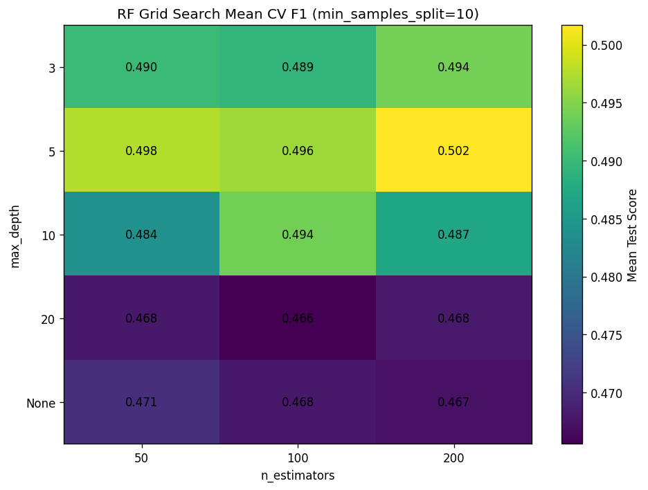
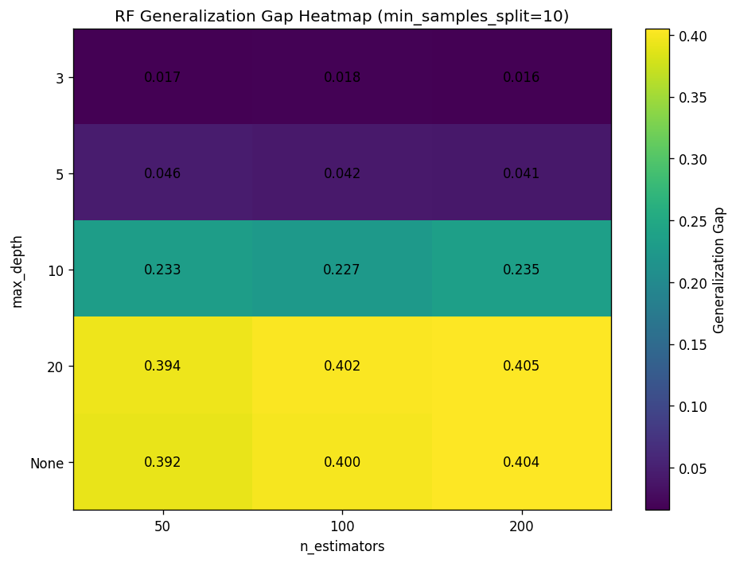
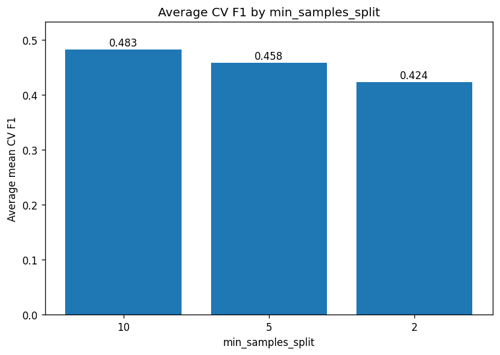
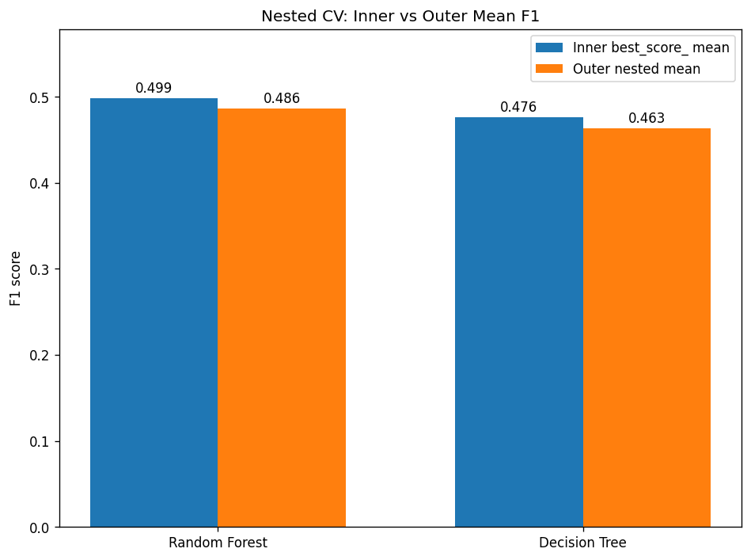
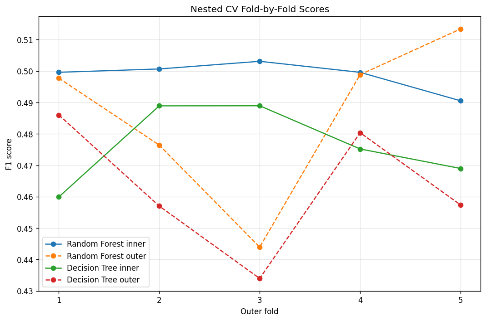

# Stretch 5B — Hyperparameter Tuning & Nested Cross-Validation

## Overview

This repository contains my solution for **Module 5 Week B — Stretch: Hyperparameter Tuning & Nested Cross-Validation** on the Petra Telecom churn dataset.

The project is divided into two parts:

- **Part 1 — GridSearchCV**  
  Systematic hyperparameter tuning for a `RandomForestClassifier` using stratified 5-fold cross-validation and `F1` scoring.

- **Part 2 — Nested Cross-Validation**  
  Honest performance estimation using an outer cross-validation loop and an inner `GridSearchCV` loop, comparing:
  - `RandomForestClassifier`
  - `DecisionTreeClassifier`

The main goal is not only to find strong hyperparameters, but also to measure how much ordinary grid-search scores can overestimate real model performance.

---

## Dataset

The dataset used is `telecom_churn.csv`.

### Target
- `churned` — binary target indicating whether the customer churned.

### Features used
The analysis uses the following numeric features:

- `tenure`
- `monthly_charges`
- `total_charges`
- `num_support_calls`
- `senior_citizen`
- `has_partner`
- `has_dependents`
- `contract_months`

### Class balance
- Total dataset size: **4500 rows**
- Churn rate: **16.36%**

This is an imbalanced classification problem, so I used **F1 score** as the main metric instead of accuracy.

---

## Repository Structure

```text
.
├── data/
│   └── telecom_churn.csv
├── results/
│   ├── gridsearch_results_detailed.csv
│   ├── near_best_configs.csv
│   ├── min_samples_split_summary.csv
│   ├── min_samples_split_summary.png
│   ├── rf_gridsearch_heatmap.png
│   ├── rf_generalization_gap_heatmap.png
│   ├── part1_summary.md
│   ├── nested_cv_fold_results.csv
│   ├── nested_cv_summary.csv
│   ├── nested_cv_best_params_frequency.csv
│   ├── nested_cv_mean_scores.png
│   ├── nested_cv_fold_scores.png
│   └── nested_cv_comparison.md
├── stretch_part1.py
├── stretch_part2.py
└── README.md
```

---

## Part 1 — GridSearchCV

### Objective
Tune a `RandomForestClassifier` using systematic hyperparameter search.

### Parameter grid
- `n_estimators`: `50, 100, 200`
- `max_depth`: `3, 5, 10, 20, None`
- `min_samples_split`: `2, 5, 10`

### Method
- Train/test split: **80/20**
- Cross-validation: **5-fold StratifiedKFold**
- Metric: **F1**
- Model: `RandomForestClassifier(class_weight="balanced")`

### Best model
- `max_depth = 5`
- `min_samples_split = 10`
- `n_estimators = 200`

### Scores
- **Best inner CV F1:** `0.502`
- **Hold-out test F1:** `0.466`

### Additional analysis
I also added:
- **generalization gap** (`mean_train_score - mean_test_score`)
- **near-best configurations** within `0.005` of the best score
- **min_samples_split summary**
- **one-standard-error rule** to identify a simpler competitive model

### One-standard-error rule result
A simpler model within one standard error of the best score was:

- `max_depth = 3`
- `min_samples_split = 10`
- `n_estimators = 50`
- `mean_test_score = 0.490`

This is useful because it shows that a simpler model can stay very close to the best-performing configuration.

### Interpretation
The strongest-performing region is centered around **`max_depth = 5`**, not around a single isolated configuration. There were **7 configurations within 0.005 of the best score**, which suggests a **sweet spot** and a mild **performance plateau**.

The generalization-gap heatmap shows that deeper trees (`max_depth = 10, 20, None`) create much larger train–test gaps, which indicates stronger overfitting. In contrast, moderate depth performs better and generalizes more cleanly.

The `min_samples_split` analysis also shows a clear regularization effect:

- `min_samples_split = 10` had the best average CV F1
- `min_samples_split = 2` had the worst average CV F1 and the largest average generalization gap

This suggests that the dataset benefits from **more conservative splitting**, not more aggressive tree growth.

---

## Part 1 Visuals

### Mean CV F1 heatmap


### Generalization gap heatmap


### Average CV F1 by min_samples_split


---

## Part 2 — Nested Cross-Validation

### Objective
Measure the selection bias of ordinary `GridSearchCV.best_score_` by using nested cross-validation.

### Why nested CV?
`GridSearchCV.best_score_` is computed on the same data used to select the best hyperparameters. That means it is usually **optimistically biased**.

Nested cross-validation fixes this by separating:
- **inner loop** → hyperparameter tuning
- **outer loop** → honest model evaluation

### Models compared
- `RandomForestClassifier(class_weight="balanced")`
- `DecisionTreeClassifier(class_weight="balanced")`

### Outer loop
- **5-fold StratifiedKFold**
- Different random state from the inner loop

### Inner loop
- `GridSearchCV`
- Same scoring metric: **F1**

---

## Part 2 Results

### Summary table

| Metric | Random Forest | Decision Tree |
|---|---:|---:|
| Inner best_score_ (mean across 5 outer folds) | 0.499 | 0.476 |
| Outer nested CV score (mean across 5 outer folds) | 0.486 | 0.463 |
| Gap (inner - outer) | 0.013 | 0.013 |
| Mean absolute gap | 0.022 | 0.026 |
| Inner score std | 0.005 | 0.013 |
| Outer score std | 0.027 | 0.021 |
| Gap std | 0.031 | 0.032 |

### Best-parameter frequency
#### Random Forest
The best Random Forest hyperparameters varied across folds, which suggests that several configurations perform similarly well.

#### Decision Tree
The Decision Tree selected the same configuration in most folds:

- `{"max_depth": 3, "min_samples_split": 2}` → 4 folds
- `{"max_depth": 5, "min_samples_split": 10}` → 1 fold

### Interpretation
Both model families showed **small optimistic bias**, since the mean inner score was higher than the mean outer score.

However, **Random Forest remained the stronger model overall**:
- **Random Forest outer nested F1 = 0.486**
- **Decision Tree outer nested F1 = 0.463**

The average gap was slightly larger for the Decision Tree, and its mean absolute gap was also larger. This is consistent with the idea that a single tree is usually more sensitive to the training data, while Random Forest reduces variance through bagging.

The difference between the two gaps is not large in this dataset, but the final conclusion is still clear: **Random Forest is the better final model family**.

---

## Part 2 Visuals

### Inner vs outer mean F1


### Fold-by-fold nested CV scores


---

## Key Findings

1. **`max_depth = 5` is the main sweet spot** for Random Forest performance.
2. **Higher tree depth increases overfitting**, as shown by the generalization-gap heatmap.
3. **`min_samples_split = 10` works best on average**, which indicates that stronger regularization helps on this dataset.
4. The Part 1 grid-search score is useful for tuning, but it is **slightly optimistic**.
5. Nested CV gives a more honest estimate of final performance.
6. **Random Forest is the best final choice** among the tested model families.

---

## Final Recommendation

Based on both parts of the analysis, I would choose:

### Final model family
- **Random Forest**

### Recommended tuned configuration
- `max_depth = 5`
- `min_samples_split = 10`
- `n_estimators = 200`

### Practical note
If model simplicity or training cost matters, the one-standard-error result suggests that a simpler competitive alternative is:

- `max_depth = 3`
- `min_samples_split = 10`
- `n_estimators = 50`

This simpler model performs very close to the best configuration and may be a reasonable tradeoff in some deployment settings.

---

## How to Run

### 1) Create and activate a virtual environment
```bash
python -m venv .venv
source .venv/bin/activate
```

### 2) Install dependencies
```bash
pip install -r requirements.txt
```

### 3) Run Part 1
```bash
python stretch_part1.py
```

### 4) Run Part 2
```bash
python stretch_part2.py
```

---

## Requirements

Suggested `requirements.txt`:

```txt
matplotlib
numpy
pandas
scikit-learn
```

---

## Final Takeaway

This project shows the difference between **finding a good configuration** and **honestly estimating how well that configuration will generalize**. Grid search identified a strong Random Forest region, but nested cross-validation showed that the raw tuning score was slightly optimistic. After correcting for that bias, Random Forest still remained the strongest model.